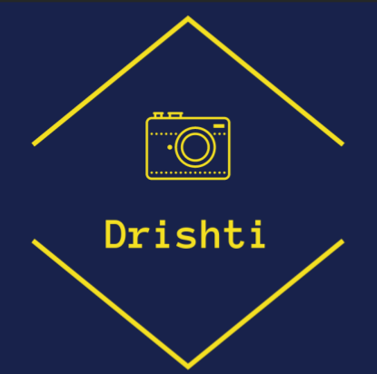
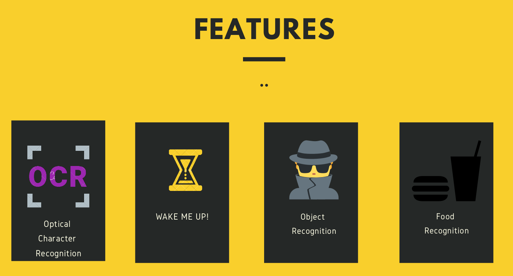

# DRISHTI - Image Analysis Android Application

## Features : 
	
	- OCR - Optical Character Recognition
		- Can aide the visually impaired , digitize paper documents
	- StubbornAlarm
		- Stops only when you click a pic of specified object
	- Object Recognition with Speech output
		- Recognises objects and shouts it out.
	- Indian Food Recognition
		- Recognises 40+ Indian dishes with 83% accuracy.

## Tech stack : 
	- Python 
	- Java
	- TFLite

